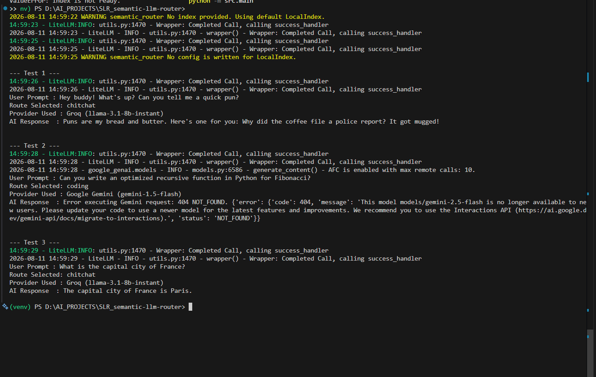

# ⚡ Semantic LLM Router

An intelligent, low-latency LLM routing engine built with **Semantic Router**, **Google Gemini**, and **Groq**.

This project evaluates prompt intent at runtime using semantic vector embeddings, routing lightweight queries to ultra-fast models and complex reasoning/coding prompts to heavier models.

---

## 🎯 Key Features

* **Intent-Based Routing:** Uses cosine similarity on prompt embeddings to route requests without extra LLM overhead.
* **Cost & Latency Optimization:** Directs simple queries to fast models (Groq / Llama 3) and complex queries to larger models (Gemini).
* **Automatic Fallback:** Includes error handling to default back to primary LLMs if a service call fails.

---

## 🛠️ Architecture Overview

```
                    ┌──────────────────┐
                    │   User Prompt     │
                    └────────┬──────────┘
                             │
                             ▼
                 ┌────────────────────────────┐
                 │   Semantic Route Layer      │
                 │ (LiteLLMEncoder →            │
                 │  gemini-embedding-001,        │
                 │  local vector index)          │
                 └──────────┬────────────────────┘
                             │
    ┌────────────────────────┼───────────────────────┐
    │ [Intent: Chitchat]     │ [Intent: Coding]       │ [Intent: Fallback]
    ▼                        ▼                        ▼
┌──────────────┐        ┌────────────────┐      ┌────────────────┐
│  Groq API    │        │  Gemini API    │      │  Gemini API    │
│ (Llama-3.1)  │        │ (3.5-Flash)    │      │ (Fallback)     │
└──────────────┘        └────────────────┘      └────────────────┘
```

The route layer embeds the incoming prompt with Gemini's embedding model, compares it against pre-embedded example utterances for each route (via cosine similarity in a local in-memory index), and dispatches to whichever provider matches best.

---

## 🚀 Quickstart Guide

### 1. Clone the Repository
```bash
git clone https://github.com/DarshanBhabad/SLR_-semantic_LLM_routing-.git
cd semantic-llm-router
```

### 2. Set Up Virtual Environment
```bash
python -m venv venv
source venv/bin/activate  # On Windows use: venv\Scripts\activate
pip install -r requirements.txt
```

### 3. Configure API Keys
Copy `.env.example` to `.env` and add your free tier API keys:
```bash
cp .env.example .env
```

Edit `.env`:
```
GEMINI_API_KEY="your_gemini_api_key_here"
GROQ_API_KEY="your_groq_api_key_here"
```

You can get free API keys here:
- Gemini: https://aistudio.google.com/apikey
- Groq: https://console.groq.com/keys

### 4. Run the Demo
```bash
python -m src.main
```

---

## 🧪 Example Output

```
--- Test 1 ---
User Prompt   : Hey buddy! What's up? Can you tell me a quick pun?
Route Selected: chitchat
Provider Used : Groq (llama-3.1-8b-instant)
AI Response   : Puns are my bread and butter. Here's one for you: Why did the coffee file a police report? It got mugged!

--- Test 2 ---
User Prompt   : Can you write an optimized recursive function in Python for Fibonacci?
Route Selected: coding
Provider Used : Google Gemini (gemini-3.5-flash)
AI Response   : Here is an optimized Fibonacci function using memoization...

--- Test 3 ---
User Prompt   : What is the capital city of France?
Route Selected: chitchat
Provider Used : Groq (llama-3.1-8b-instant)
AI Response   : The capital city of France is Paris.
```

**Screenshot of a real terminal run:**




## 🐞 Issues Faced & Resolutions

While building this, three separate issues surfaced across two libraries (`litellm` / `semantic-router`) and one provider (`google-genai`). Each is documented here for reference

### 1. Gemini embedding model `404 Not Found`


**Fix:**  the single remaining encoder at the current model:
```python
encoder = LiteLLMEncoder(
    name="gemini/gemini-embedding-001",
    api_key=GEMINI_API_KEY
)
```


### 2. `ValueError: Index is not ready.`
**Symptom:**
```
File ".../semantic_router/routers/base.py", line 596, in __call__
    raise ValueError("Index is not ready.")
ValueError: Index is not ready.
```

**Root cause:** Constructing `SemanticRouter(encoder=encoder, routes=[...])` does **not** automatically embed the routes' utterances and write them into the local vector index. Without an explicit sync step, the index stays empty, and any call to `router(prompt)` fails the `is_ready()` check.

**Fix:** Pass `auto_sync="local"` so the router embeds all route utterances and populates the `LocalIndex` on initialization:
```python
router = SemanticRouter(
    encoder=encoder,
    routes=[chitchat_route, coding_route],
    auto_sync="local"
)
```


### 3. Gemini generation model `404 — model no longer available`
**Symptom:**
```
AI Response : Error executing Gemini request: 404 NOT_FOUND. {'error': {'code': 404,
'message': 'This model models/gemini-2.5-flash is no longer available to new users.
Please update your code to use a newer model...', 'status': 'NOT_FOUND'}}
```

**Root cause:** The code originally called `gemini-1.5-flash` for the "coding" route (via `call_gemini_advanced`), which is also an old, retired model family. It was first updated to `gemini-2.5-flash`, but that model turned out to already be restricted for this project/API key despite Google's own deprecation table listing "no shutdown date" for it — Google appears to be narrowing access to older models ahead of the officially published schedule.

**Fix:** Moved to the current GA model with no shutdown date announced:
```python
response = gemini_client.models.generate_content(
    model="gemini-3.5-flash",
    contents=prompt,
)
```


## 📂 Project Structure

```
semantic-llm-router/
├── .env.example
├── .gitignore
├── requirements.txt
├── README.md
├── docs/
│   └──  output.png
│  

└── src/
    ├── __init__.py
    ├── config.py
    ├── router.py
    └── main.py
```

---

## 📜 License

MIT
